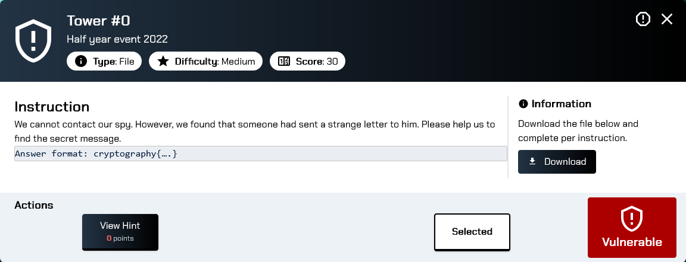
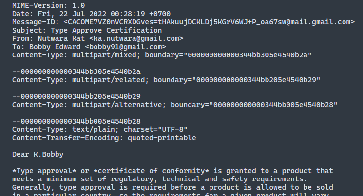
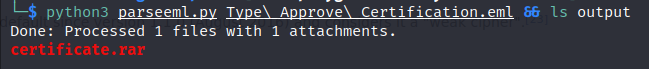
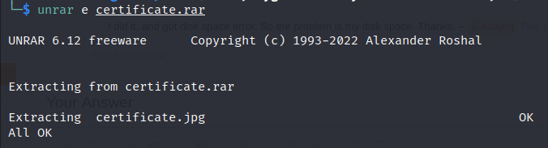
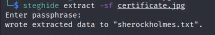
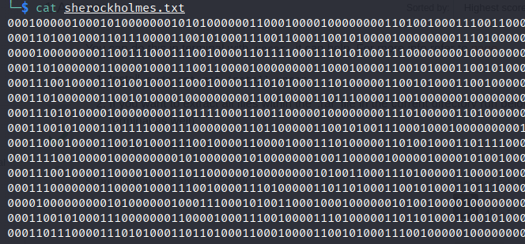
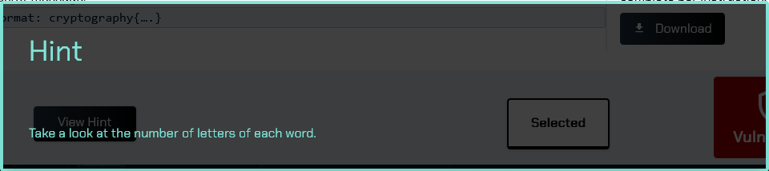
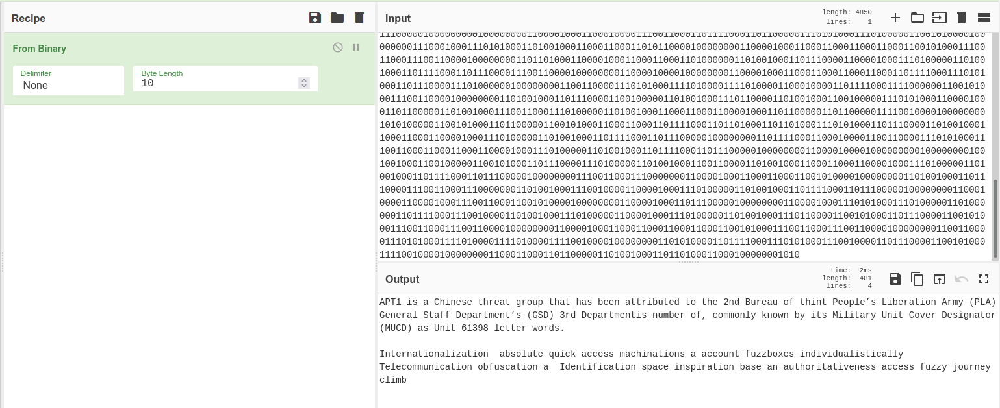
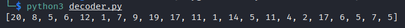
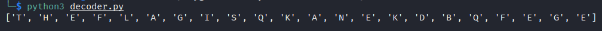

The downloaded file is an `.eml` file which is the email file format. We can inspect it using any text editor.



After scrolling through the file, we found that there are some attachments -- a PNG image and a RAR file.

I found this useful script (https://gist.github.com/urschrei/5258588) that can extract attachments from `.eml` file and used it to extract a file named `certificate.rar` from the email.



After extracting the `.rar` file, we got a file named `certificate.jpg`. Since we are supposed to find the secret message. I think maybe it's hidden in this image.



So I tried running `steghide` on `certificate.jpg` using empty passphrase and found `sherockholmes.txt` file hidden inside the image.



The text file contains a bunch of 1's and 0's:



I tried using CyberChef to decode the message but couldn't figure out what it is. So I clicked on the Hint button.



Still have no clue what it's talking about 🤨

After fumbling around in CyberChef for about an hour, I found the Recipe that works:



Now the Hint is starting to make sense...

The first paragraph looks like normal sentences talking about APT1 threat group, but the second paragraph looks suspicious -- it's just a bunch of random words.

I pasted it in a file named `message.txt`

```
Internationalization  absolute quick access machinations a account fuzzboxes individualistically Telecommunication obfuscation a  Identification space inspiration base an authoritativeness access fuzzy journey climb
```

Hmm…, maybe we can apply the Hint to the above message? I wrote a simple Python script to _"count the number of letters in each word"_ in the message. Here's the result:



Looking at these numbers, I thought they may be used to indicate the position of English letters (the number never exceeds 26) so I modified the script to confirm my theory and got this:



This is the result after the last revision of the script for easier copy and paste:


```
Flag: cryptography{QKANEKDBQFEGE}
```

And here's the `decoder.py` script

```python
#!/usr/bin/env python

import string

with open("message.txt", "r") as f:
	lines = f.read()
	words = lines.split()
	numbers = [len(w) for w in words]
	letters = [string.ascii_uppercase[n - 1] for n in numbers]
	print(''.join(letters))
```
